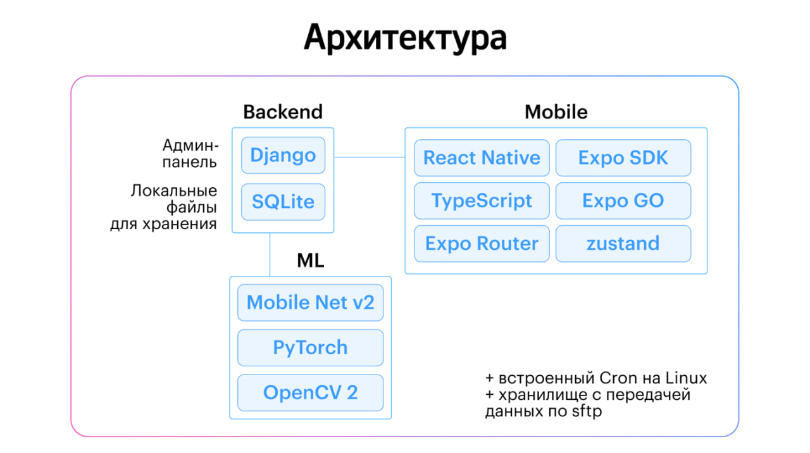

## 👥 Команда

**Состав команды:**
- Зонтов Никита Олегович
- Меркулов Максим Алексеевич
- Шубина Светлана Олеговна
- Шабуров Павел Олегович
- Басанский Денис Васильевич

## 🧩 Проблема и задача

Приложение создано для упрощения работы инспекторов энергосетевых компаний. 
Оно позволяет:
- вводить данные об объекте, составлять акт без ручки и бумаги;
- загружать фото приборов, которые распознаются автоматически, учёта;
- сохраняет акты и фотографии с помощью SFTP на сервер, не сохраняя персональные данные из актов.

## 📱 Демонстрация приложения
https://drive.google.com/file/d/1zFqTmnYP2LcmktYQsB5wFQ2QJBDUXZ2J/view?usp=drive_link
---

## 📁 Структура проекта

- `mobile/` — мобильное приложение (Android) на React Native и Expo.
- `secon_project/` — серверная часть (Django + REST API).
- `Augmentation_for_meters.ipynb` - аугментация для счетчиков.
- `Classification_for_meters.ipynb` - классификация для счетчиков.
---

## 🛠️ Архитектура проекта

---

## 🚀 Как развернуть

1. **Обучить модель для распознавания счётчиков**
   - Открыть и запустить `Classification_for_meters.ipynb`.

2. **Развернуть сервер (Django Rest Framework) одной командой**
   ```bash
   docker compose up --build
   ```

3. **Установить мобильное приложение**
   - Установить `.apk` по ссылке https://drive.google.com/drive/folders/1kE7J8aDwZuHTnAUn3dV6uKWWv8rmULEw?usp=drive_link.

---

## ⏰ Ежедневное обращение к серверу

Для запуска регулярных задач используется **`crontab`**, встроенный планировщик в Linux. Это надёжное решение, не требующее дополнительных библиотек или сервисов.
**`crontab`** реализует системное обращение к серверу для выгрузки отчетов и обновления задач для инструкторов.

---

## 🗂️ Хранение актов и фото

Файлы хранятся строго по шаблону:

```
{адрес объекта}_{дата}_{время}_{порядковый номер фотографии}
```

Передача файлов осуществляется по **SFTP** — надёжному защищённому протоколу.

### Пример структуры:

```
Хранилище/
├── Входные/
│   ├── входные_данные.xlsx
│   └── входные_данные_13042025_обработано.xlsx
├── Отчеты/
│   └── 13042025/
│       └── бригада_Иванов_Петров/
│           └── г.Пенза_ул.Лунная_дом6_кв10/
├── Результаты/
│   └── отчет_по_13042025.xlsx
```

---

## 📡 API эндпоинты

1. `crm/`
2. `server/test/`
3. `server/load/`
4. `server/tasks/`
5. `server/act_ed/`
6. `server/act_control/`
7. `server/task/<int:task_id>/`
8. `server/save_photo/`
9. `server/check_photo/`
10. `server/result/`

---

## 📦 Используемые технологии

- **Backend**: Django, REST Framework, PostgreSQL
- **Frontend**: React Native (Expo)
- **ML**: PyTorch, pandas, openpyxl
- **Интеграции**: SFTP, cron

---

> Разработано с вниманием к деталям ❤️ командой **MISIS GO**
